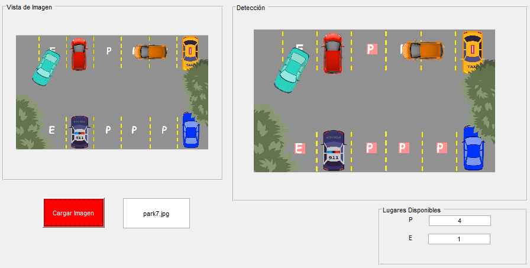
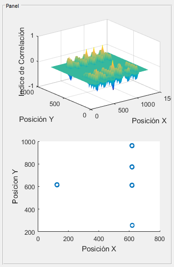
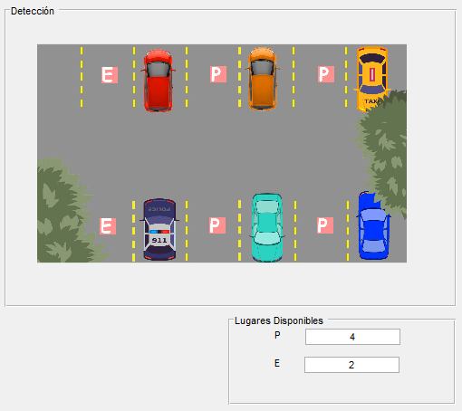
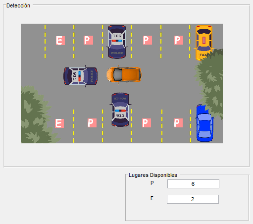
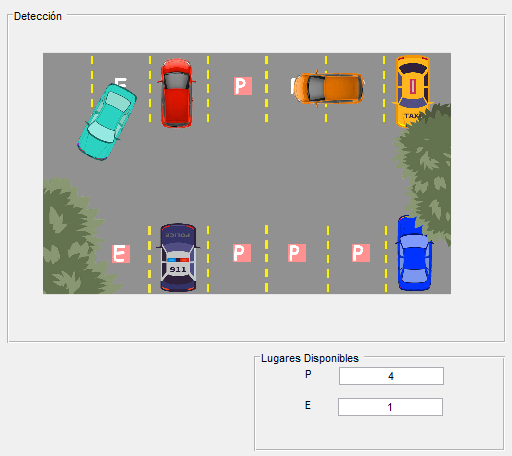
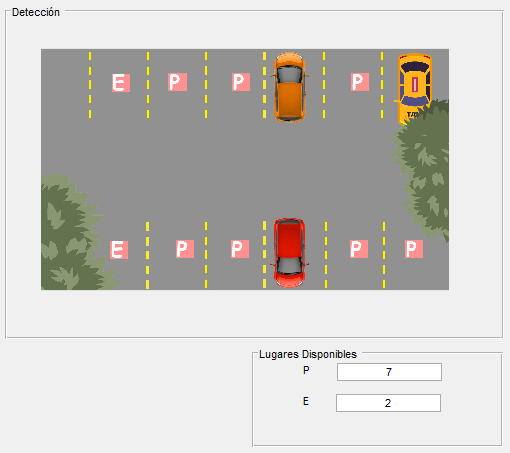
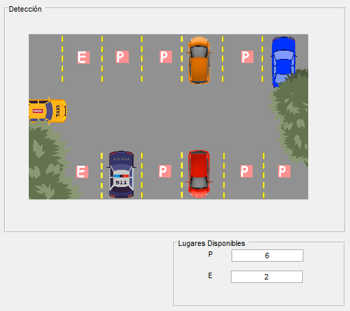
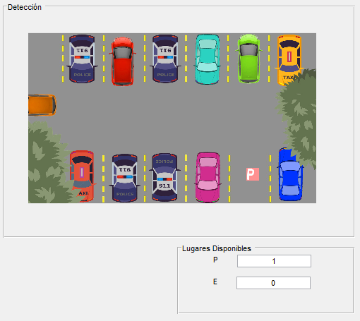

# Parking Slot Detection with K-means Algorithm

La detección de plazas disponibles en un parqueadero se pueden realizar de muchas maneras, a traves de transductores ultrasonicos, visores, placas electromagnéticas entre otras. Los sistemas y las metodologias son muy variadas, desde una circuiteria digital básica, hasta sistemas inteligentes con tecnología IoT. En el siguiente repositorio se da una solución a través del análisis por correlación cruzada y el algoritmo k-means para la detección de lugares disponibles en un aparcamiento, en el cual se contara el numero de lugares disponibles con la denominación de P (Aparcamiento Regular) y E (Personas Discapacitadas), y también se encontrara el par de coordenadas que represente el lugar disponible. Este a su vez tiene una interfaz gráfica para mostrar adecuadamente los resultados y se pondrá a prueba del sistema para 10 casos distintos del aparcamiento.

**Guia:**

```bash
git clone htpps://github.com/ndcastillo/Detection-Slot-Detection.git
```

**Intrucciones***

1.- Cargar la carpeta descomprimida en 'Current Folder' dentro de Matlab

2.- Ejecutar en el WorkSpace de Matlab el script interface.m     

       Nos aparecera una ventana donde se encuentre la interfaz grafica

La interfaz contiene un boton rojo denominado Cargar Imagen, y una caja de texto donde ira el nombre de la figura a la cual yo quiero cargar.

3.- Dar un click en Cargar imagen y se mostrara la figura escogida y los lugares de aparcamiento disponibles.

**Resultados**









